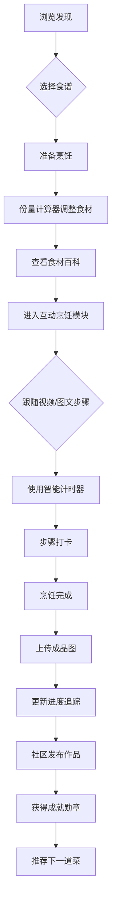

## 1. Product Overview
全球风味厨房是一款支持多语种的美食食谱在线平台，涵盖中餐、西餐、日料、韩式料理等全球主流菜系。平台打造沉浸式烹饪学习体验，通过图文、视频及互动指导，帮助用户从零开始掌握世界各地美食的制作方法。

## 2. Core Features

### 2.1 User Roles
| Role | Registration Method | Core Permissions |
|------|---------------------|------------------|
| Normal User | Email/Phone/WeChat/Apple ID | Browse recipes, save favorites, upload photos, participate in community |

### 2.2 Feature Modules
1. **首页**: 推荐食谱、分类导航、搜索功能
2. **食谱详情页**: 分级体系、食材百科、分步图解/视频、智能计时器、份量计算器
3. **烹饪进度追踪**: 步骤打卡、历史记录、数据统计
4. **用户个人主页**: 拿手菜展示、美食相册、成就勋章
5. **美食社区**: 作品广场、话题挑战、互动功能
6. **登录注册**: 多方式登录、用户账户管理

### 2.3 Page Details
| Page Name | Module Name | Feature description |
|-----------|-------------|---------------------|
| 首页 | Hero区域 | 轮播推荐热门食谱 |
| 首页 | 分类导航 | 按菜系、难度、场景分类 |
| 首页 | 个性化推荐 | 基于用户偏好推荐食谱 |
| 食谱详情页 | 分级标识 | Easy/Medium/Hard难度标签 |
| 食谱详情页 | 食材百科 | 点击查看食材详情和替代方案 |
| 食谱详情页 | 分步教程 | 图文/视频Step-by-Step指导 |
| 食谱详情页 | 智能计时器 | 内嵌多个计时器，支持后台运行 |
| 食谱详情页 | 份量计算器 | 调整人数自动换算食材用量 |
| 进度追踪页 | 步骤打卡 | 标记当前步骤，防止遗忘 |
| 进度追踪页 | 历史记录 | 记录已尝试菜肴，上传成品图 |
| 进度追踪页 | 数据统计 | 烹饪热力图、常做菜系统计 |
| 个人主页 | 用户信息 | 展示用户资料和成就 |
| 个人主页 | 拿手菜 | 用户收藏和擅长的菜肴 |
| 个人主页 | 美食相册 | 用户上传的成品照片 |
| 社区页 | 作品广场 | 用户作品展示、点赞评论 |
| 社区页 | 话题挑战 | 每周话题活动展示 |
| 登录页 | 多方式登录 | 手机号、邮箱、第三方账号 |

## 3. Core Process

## 4. User Interface Design

### 4.1 Design Style
- **主色调**: 温暖橙色(#FF8C42)，代表热情与美食的诱惑
- **辅助色**: 清新绿色(#4CAF50)用于成功状态，蓝色(#2196F3)用于交互元素
- **按钮风格**: 圆角矩形，悬停有缩放动画效果
- **字体**: 标题使用"Playfair Display"衬线字体，正文使用"Inter"无衬线字体
- **布局**: 卡片式设计，图片为主导，营造美食诱惑氛围
- **图标风格**: 简约线性图标，配合温暖色调

### 4.2 Page Design Overview
| Page Name | Module Name | UI Elements |
|-----------|-------------|-------------|
| 首页 | Hero区域 | 全屏美食图片轮播，渐变遮罩，CTA按钮 |
| 首页 | 分类导航 | 横向滚动分类标签，图标+文字 |
| 首页 | 推荐列表 | 卡片瀑布流，展示食谱封面、名称、难度、时长 |
| 食谱详情页 | 顶部区域 | 大图展示，难度/时长/菜系标签 |
| 食谱详情页 | 食材列表 | 可点击食材卡片，弹窗显示详情 |
| 食谱详情页 | 步骤区域 | 序号卡片，支持图片放大和视频播放 |
| 食谱详情页 | 计时器模块 | 多个计时器卡片，独立控制 |
| 社区页 | 作品广场 | 网格布局图片墙，悬停显示操作按钮 |
| 个人主页 | 头部区域 | 用户头像、等级称号、成就徽章展示 |

### 4.3 Responsiveness
- **桌面端**: 多列布局，完整功能展示
- **平板端**: 自适应两列布局
- **移动端**: 单列布局，优化触摸操作，底部导航栏

### 4.4 Animation Effects
- 页面切换平滑过渡
- 卡片悬停缩放和阴影效果
- 计时器倒计时动画
- 步骤完成进度条动画
- 成就解锁庆祝动画