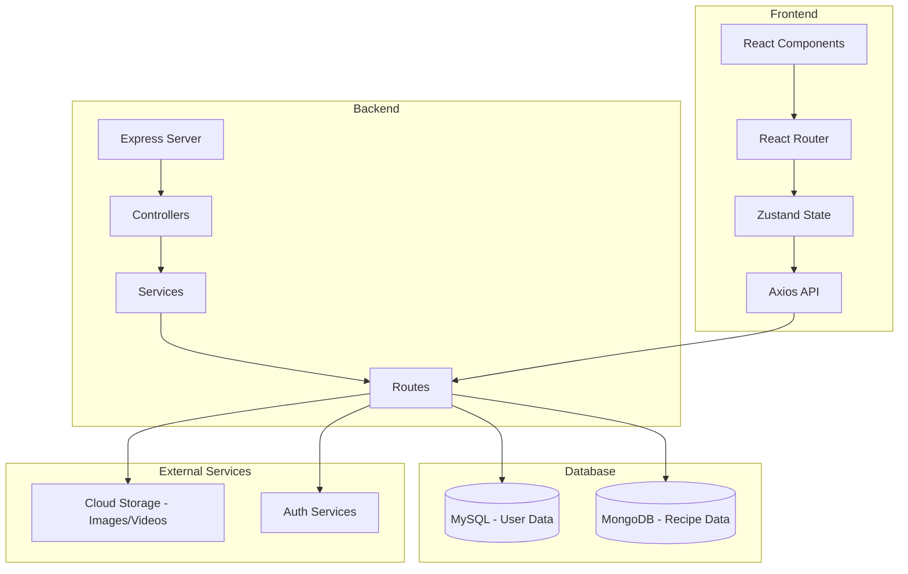
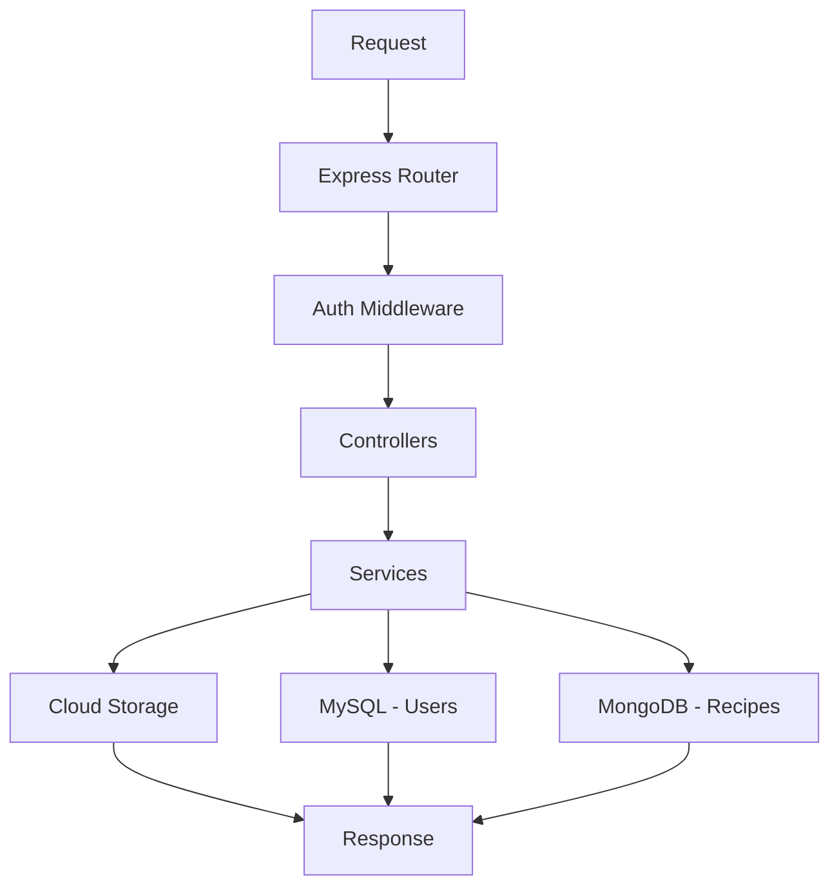
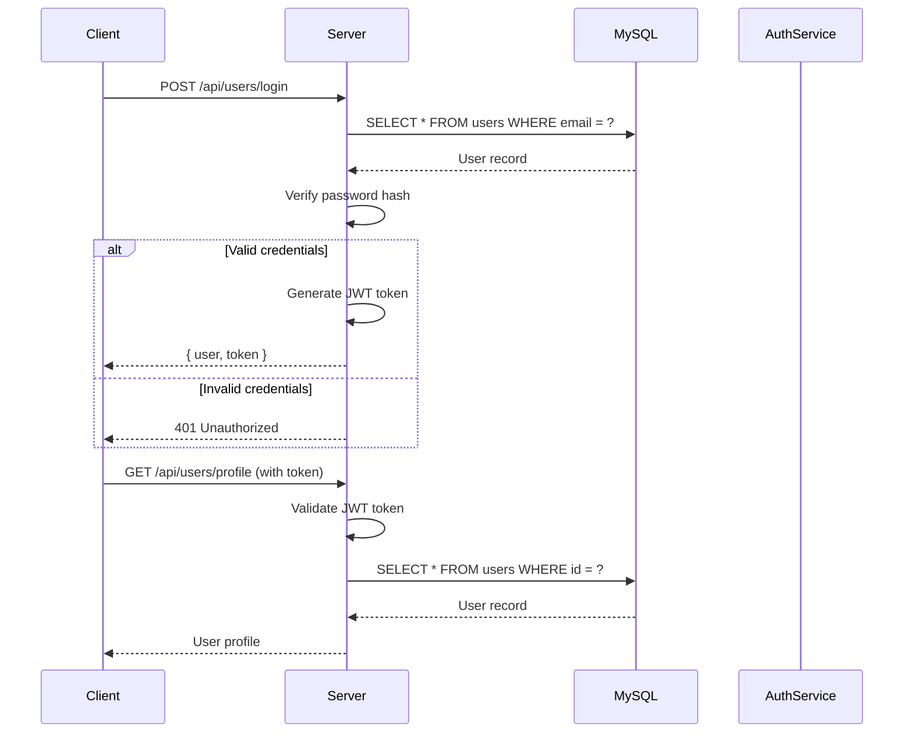
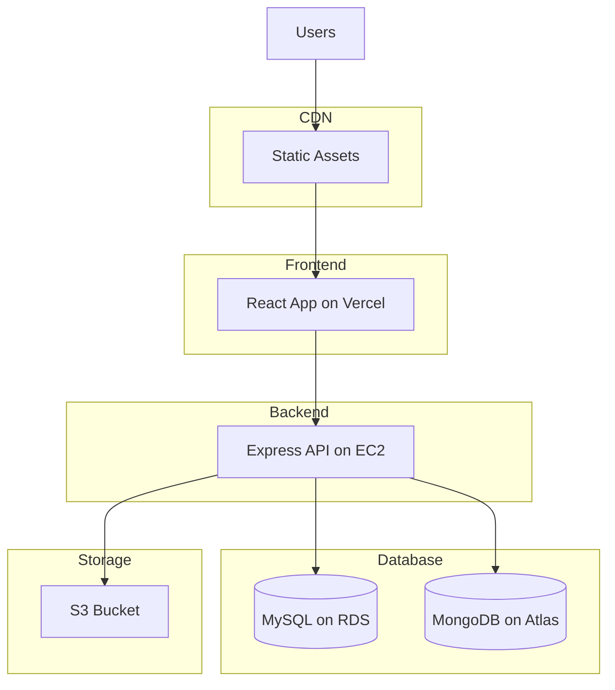

## 1. Architecture Design



## 2. Technology Description

| Layer | Technology | Version |
|-------|------------|---------|
| Frontend Framework | React | 18.x |
| Frontend Language | TypeScript | 5.x |
| Build Tool | Vite | 6.x |
| CSS Framework | Tailwind CSS | 3.x |
| State Management | Zustand | 4.x |
| Router | React Router DOM | 6.x |
| HTTP Client | Axios | 1.x |
| Icons | Lucide React | latest |
| Backend Framework | Express | 4.x |
| Backend Language | TypeScript | 5.x |
| User Database | MySQL | 8.x |
| Recipe Database | MongoDB | 7.x |
| Storage | Cloud Storage | - |

## 3. Route Definitions

| Route | Component | Purpose |
|-------|-----------|---------|
| `/` | HomePage | 首页，展示推荐食谱 |
| `/recipes` | RecipeListPage | 食谱列表页 |
| `/recipes/:id` | RecipeDetailPage | 食谱详情页 |
| `/cooking/:id` | CookingPage | 互动烹饪页面 |
| `/profile` | ProfilePage | 用户个人主页 |
| `/profile/:userId` | UserProfilePage | 其他用户主页 |
| `/community` | CommunityPage | 美食社区页 |
| `/challenges` | ChallengesPage | 话题挑战页 |
| `/login` | LoginPage | 登录页面 |
| `/register` | RegisterPage | 注册页面 |
| `/progress` | ProgressPage | 烹饪进度追踪页 |

## 4. API Definitions

### 4.1 Recipe API

#### GET /api/recipes
获取食谱列表

**Request:**
```typescript
interface RecipeListRequest {
  page?: number;
  limit?: number;
  difficulty?: 'easy' | 'medium' | 'hard';
  cuisine?: string;
  search?: string;
}
```

**Response:**
```typescript
interface RecipeListResponse {
  data: Recipe[];
  pagination: {
    page: number;
    limit: number;
    total: number;
    pages: number;
  };
}
```

#### GET /api/recipes/:id
获取食谱详情

**Response:**
```typescript
interface Recipe {
  _id: string;
  name: string;
  nameEn: string;
  difficulty: 'easy' | 'medium' | 'hard';
  cuisine: string;
  cookTime: number; // 分钟
  servings: number;
  ingredients: Ingredient[];
  steps: Step[];
  timers: Timer[];
  images: string[];
  videoUrl?: string;
  description: string;
  tags: string[];
  createdAt: Date;
  updatedAt: Date;
}

interface Ingredient {
  name: string;
  nameEn: string;
  quantity: string;
  unit: string;
  substitutes?: string[];
}

interface Step {
  number: number;
  title: string;
  description: string;
  image?: string;
  videoUrl?: string;
}

interface Timer {
  id: string;
  name: string;
  duration: number; // 秒
  stepNumber: number;
}
```

#### POST /api/recipes
创建食谱（管理员）

### 4.2 User API

#### POST /api/users/register
用户注册

**Request:**
```typescript
interface RegisterRequest {
  email: string;
  phone?: string;
  password: string;
  nickname: string;
}
```

**Response:**
```typescript
interface UserResponse {
  id: string;
  email: string;
  nickname: string;
  avatar?: string;
  level: number;
  exp: number;
  title: string;
}
```

#### POST /api/users/login
用户登录

**Request:**
```typescript
interface LoginRequest {
  email?: string;
  phone?: string;
  password?: string;
  socialType?: 'wechat' | 'apple';
  socialToken?: string;
}
```

**Response:**
```typescript
interface LoginResponse {
  user: UserResponse;
  token: string;
}
```

#### GET /api/users/profile
获取当前用户信息

### 4.3 Cooking Progress API

#### GET /api/progress
获取用户烹饪进度

**Response:**
```typescript
interface ProgressResponse {
  completedRecipes: CompletedRecipe[];
  inProgressRecipe?: CookingSession;
  statistics: ProgressStats;
}

interface CompletedRecipe {
  recipeId: string;
  recipeName: string;
  completedAt: Date;
  rating?: number;
  photoUrl?: string;
}

interface CookingSession {
  recipeId: string;
  currentStep: number;
  startedAt: Date;
  completedSteps: number[];
}

interface ProgressStats {
  totalCooked: number;
  streak: number;
  favoriteCuisine: string;
  heatmap: { date: string; count: number }[];
}
```

#### POST /api/progress/cook/:recipeId
开始烹饪会话

#### PUT /api/progress/step/:stepNumber
标记步骤完成

#### POST /api/progress/complete/:recipeId
完成烹饪

### 4.4 Community API

#### GET /api/community/posts
获取社区帖子列表

**Response:**
```typescript
interface PostListResponse {
  data: Post[];
  pagination: Pagination;
}

interface Post {
  id: string;
  userId: string;
  userName: string;
  userAvatar: string;
  recipeId?: string;
  recipeName?: string;
  content: string;
  images: string[];
  likes: number;
  comments: number;
  liked: boolean;
  createdAt: Date;
}
```

#### POST /api/community/posts
发布帖子

#### POST /api/community/posts/:id/like
点赞帖子

#### GET /api/community/posts/:id/comments
获取帖子评论

#### POST /api/community/posts/:id/comments
发布评论

### 4.5 Achievement API

#### GET /api/achievements
获取用户成就

**Response:**
```typescript
interface AchievementResponse {
  badges: Badge[];
  level: number;
  exp: number;
  nextLevelExp: number;
  title: string;
}

interface Badge {
  id: string;
  name: string;
  description: string;
  icon: string;
  unlockedAt?: Date;
  progress?: number;
  total?: number;
}
```

## 5. Server Architecture Diagram



## 6. Data Model

### 6.1 MySQL Tables (User Data)

#### users table
| Column | Type | Constraints |
|--------|------|-------------|
| id | VARCHAR(36) | PRIMARY KEY |
| email | VARCHAR(255) | UNIQUE, NOT NULL |
| phone | VARCHAR(20) | UNIQUE |
| password_hash | VARCHAR(255) | |
| nickname | VARCHAR(50) | NOT NULL |
| avatar | VARCHAR(255) | |
| level | INT | DEFAULT 1 |
| exp | INT | DEFAULT 0 |
| title | VARCHAR(50) | DEFAULT '厨房小白' |
| preferences | TEXT | JSON |
| created_at | DATETIME | DEFAULT CURRENT_TIMESTAMP |
| updated_at | DATETIME | ON UPDATE CURRENT_TIMESTAMP |

#### user_progress table
| Column | Type | Constraints |
|--------|------|-------------|
| id | INT | PRIMARY KEY AUTO_INCREMENT |
| user_id | VARCHAR(36) | FOREIGN KEY |
| recipe_id | VARCHAR(24) | NOT NULL |
| completed_at | DATETIME | |
| rating | INT | 1-5 |
| photo_url | VARCHAR(255) | |

#### user_badges table
| Column | Type | Constraints |
|--------|------|-------------|
| id | INT | PRIMARY KEY AUTO_INCREMENT |
| user_id | VARCHAR(36) | FOREIGN KEY |
| badge_id | VARCHAR(50) | NOT NULL |
| unlocked_at | DATETIME | DEFAULT CURRENT_TIMESTAMP |
| progress | INT | DEFAULT 0 |

#### community_posts table
| Column | Type | Constraints |
|--------|------|-------------|
| id | VARCHAR(36) | PRIMARY KEY |
| user_id | VARCHAR(36) | FOREIGN KEY |
| recipe_id | VARCHAR(24) | |
| content | TEXT | |
| created_at | DATETIME | DEFAULT CURRENT_TIMESTAMP |

#### community_likes table
| Column | Type | Constraints |
|--------|------|-------------|
| id | INT | PRIMARY KEY AUTO_INCREMENT |
| user_id | VARCHAR(36) | FOREIGN KEY |
| post_id | VARCHAR(36) | FOREIGN KEY |
| created_at | DATETIME | DEFAULT CURRENT_TIMESTAMP |

#### community_comments table
| Column | Type | Constraints |
|--------|------|-------------|
| id | VARCHAR(36) | PRIMARY KEY |
| user_id | VARCHAR(36) | FOREIGN KEY |
| post_id | VARCHAR(36) | FOREIGN KEY |
| content | TEXT | NOT NULL |
| created_at | DATETIME | DEFAULT CURRENT_TIMESTAMP |

### 6.2 MongoDB Collections (Recipe Data)

#### recipes collection
```typescript
interface RecipeDocument {
  _id: ObjectId;
  name: string;
  nameEn: string;
  difficulty: 'easy' | 'medium' | 'hard';
  cuisine: string;
  cookTime: number;
  servings: number;
  ingredients: {
    name: string;
    nameEn: string;
    quantity: string;
    unit: string;
    substitutes?: string[];
    description?: string;
  }[];
  steps: {
    number: number;
    title: string;
    description: string;
    image?: string;
    videoUrl?: string;
  }[];
  timers: {
    id: string;
    name: string;
    duration: number;
    stepNumber: number;
  }[];
  images: string[];
  videoUrl?: string;
  description: string;
  tags: string[];
  createdAt: Date;
  updatedAt: Date;
}
```

#### ingredients collection
```typescript
interface IngredientDocument {
  _id: ObjectId;
  name: string;
  nameEn: string;
  description: string;
  substitutes: string[];
  purchaseTips: string;
  nutrition?: {
    calories: number;
    protein: number;
    fat: number;
    carbs: number;
  };
}
```

#### challenges collection
```typescript
interface ChallengeDocument {
  _id: ObjectId;
  name: string;
  description: string;
  hashtag: string;
  startDate: Date;
  endDate: Date;
  participants: number;
  featured: boolean;
}
```

## 7. Authentication Flow



## 8. Deployment Architecture

